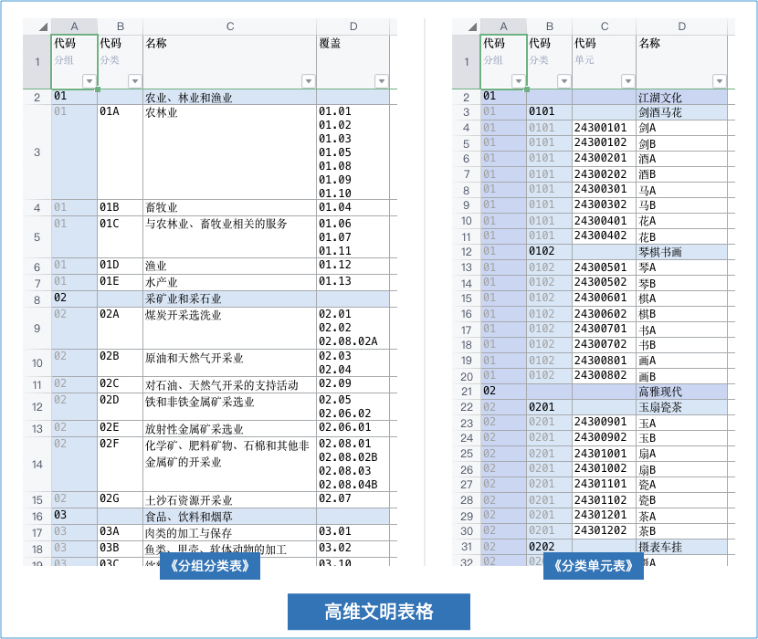
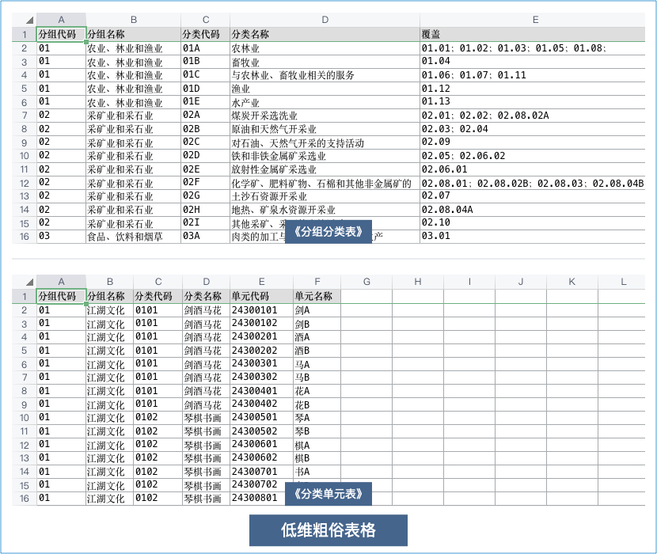
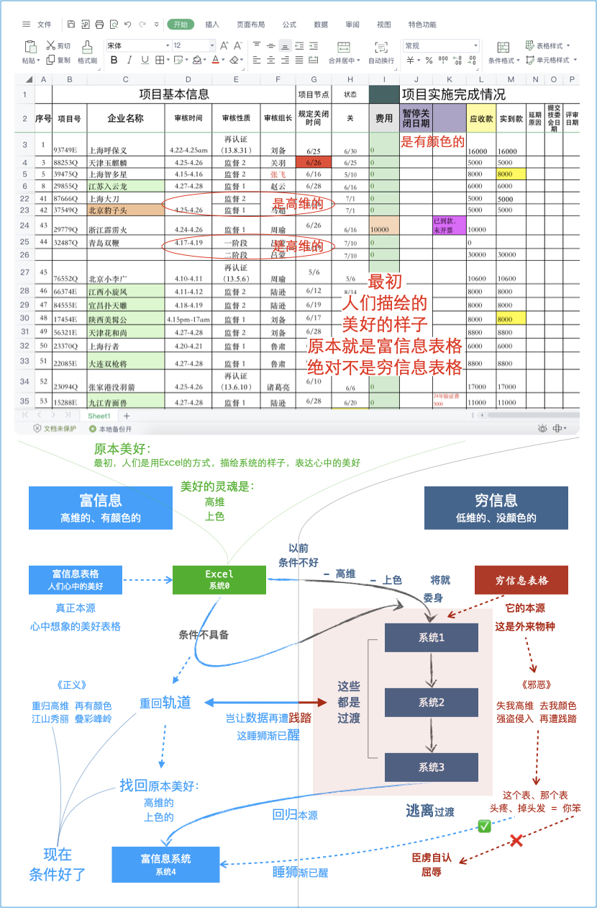
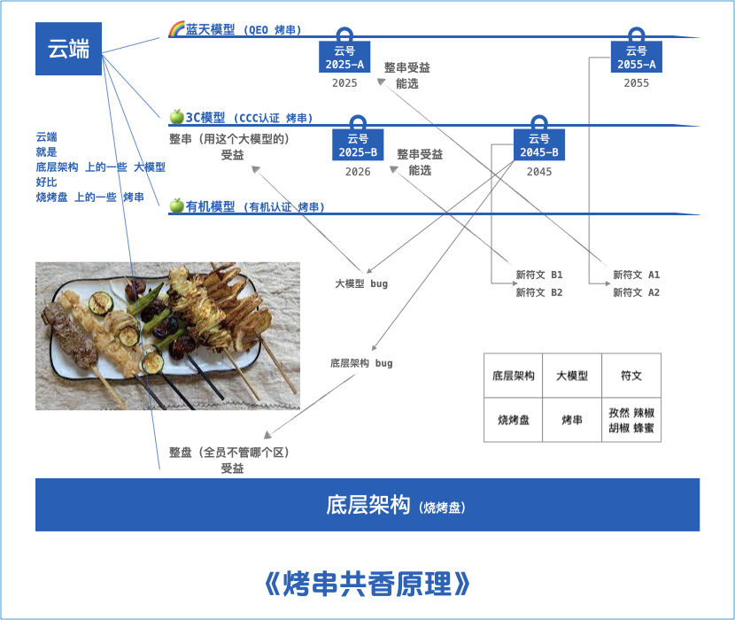
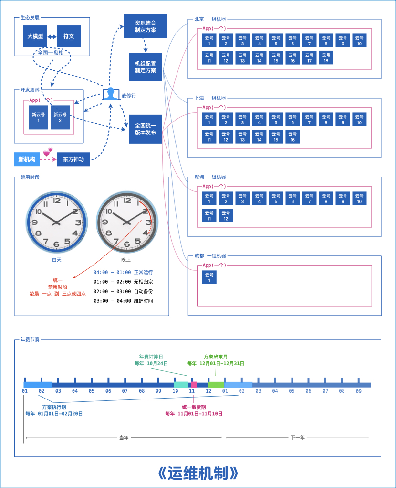

适配高网速、符合时代的：认证机构管理系统 <br/>
高维、上色、灵动！五绝，不一样的高级感 <br/>
主理人：麦修行（大江东去，唯我修行）

[麦修行][]&nbsp;&nbsp;&nbsp;&nbsp;[AI->东方神功][东方神功]&nbsp;[剧情][]&nbsp;[人物][]&nbsp;&nbsp;&nbsp;&nbsp;[原理][]&nbsp;&nbsp;[规则][]&nbsp;&nbsp;[价格][]&nbsp;&nbsp;[购买][]&nbsp;&nbsp;&nbsp;&nbsp;[大模型-符文][]&nbsp;&nbsp;&nbsp;&nbsp;[发展历程][]

[麦修行]: https://github.com/ca3w/BEST/
[东方神功]: https://github.com/ca3w/ai-dongfangshengong/
[剧情]: https://github.com/ca3w/dongfangernvqing/blob/main/root/BEST.md
[人物]: https://github.com/ca3w/dongfangernvqing/blob/main/root/renwu.md
[原理]: https://github.com/ca3w/key/
[规则]: https://github.com/ca3w/rule/
[价格]: https://github.com/ca3w/pricing/
[购买]: https://github.com/ca3w/howtobuy/
[大模型-符文]: https://github.com/ca3w/largemodel-rune/
[发展历程]: https://github.com/ca3w/development/

***

# 原理

## 认证机构管理系统的现代革新：高维文明表格 vs 低维粗俗表格

先谈两个基本概念「高维文明表格」和「低维粗俗表格」

下面，体系认证以《分组分类表》为例，产品认证以《分类单元表》为例，阐述下**需求与实现**的偏差

如果让认证机构的技术人员，用 Excel 把他**好理解**的表格表达出来 <br/>
就是说这个表要以后经常看，得和脑子里想的相对应，需要**好理解** <br/>
那么我想，Ta接近于下面的样子（这种**好理解**的叫：高维文明表格）： <br/>


如果让开发系统的技术人员，用 Excel 把他**容易做**的表格表达出来 <br/>
就是说这个表要代码上实现，得和数据库的表相对应，需要**容易做** <br/>
那么我想，Ta接近于下面的样子（这种**容易做**的叫：低维粗俗表格）： <br/>


实际上 高维文明表格 要远远好于 低维粗俗表格 <br/>
&nbsp;&nbsp;&nbsp;&nbsp;&nbsp;&nbsp;&nbsp;&nbsp;用**数据库的表逻辑**，偷偷的换掉**原本优雅、美好、易懂的人类逻辑** <br/>
&nbsp;&nbsp;&nbsp;&nbsp;&nbsp;&nbsp;&nbsp;&nbsp;等于变相强制让人全用**数据库的表逻辑**去想事情，岂能不**让人头疼** <br/>
&nbsp;&nbsp;&nbsp;&nbsp;&nbsp;&nbsp;&nbsp;&nbsp;长此以往会**改变原本直观的思维方式**：让人脑放弃直观走程序逻辑 <br/>
&nbsp;&nbsp;&nbsp;&nbsp;&nbsp;&nbsp;&nbsp;&nbsp;从「直观思维」变成「程序逻辑」，优雅、美好、易懂，就**全没了** <br/>
&nbsp;&nbsp;&nbsp;&nbsp;&nbsp;&nbsp;&nbsp;&nbsp;万恶之源在此！人脑不是程序、不是 CPU ，不应该**献祭**于 **容易做**

&nbsp;&nbsp;&nbsp;&nbsp;&nbsp;&nbsp;&nbsp;&nbsp;人脑，不应该**献祭**于 **容易做** ，那应该干什么？ <br/>
&nbsp;&nbsp;&nbsp;&nbsp;&nbsp;&nbsp;&nbsp;&nbsp;应该得到解放：解放「将程序逻辑直观化」的脑力，应该用于「**延年益寿**」： <br/>
&nbsp;&nbsp;&nbsp;&nbsp;&nbsp;&nbsp;&nbsp;&nbsp;不应该：这么个对应逻辑、那么个相互关系，想了一个小时，觉得自己很聪明，却掉了一堆头发 <br/>
&nbsp;&nbsp;&nbsp;&nbsp;&nbsp;&nbsp;&nbsp;&nbsp;而应该：一眼就看明白了，系统能把一切显示的秒懂级直观，靠我脑袋想不行，如此，**延年益寿**

那么，为什么以前的旧系统全都是 低维粗俗表格？ <br/>
&nbsp;&nbsp;&nbsp;&nbsp;&nbsp;&nbsp;&nbsp;&nbsp;以前： <br/>
&nbsp;&nbsp;&nbsp;&nbsp;&nbsp;&nbsp;&nbsp;&nbsp;网速不高，研发条件不行，网速不高做出来也带不动，没有AI的研发条件也做不出来 <br/>
&nbsp;&nbsp;&nbsp;&nbsp;&nbsp;&nbsp;&nbsp;&nbsp;现在： <br/>
&nbsp;&nbsp;&nbsp;&nbsp;&nbsp;&nbsp;&nbsp;&nbsp;时代变了，研发条件好了，过去觉得这是不可能的事，现在有AI了，已经可以实现了 <br/>
&nbsp;&nbsp;&nbsp;&nbsp;&nbsp;&nbsp;&nbsp;&nbsp;所以： <br/>
&nbsp;&nbsp;&nbsp;&nbsp;&nbsp;&nbsp;&nbsp;&nbsp;我们要革新！ <br/>
&nbsp;&nbsp;&nbsp;&nbsp;&nbsp;&nbsp;&nbsp;&nbsp;我们要做现代高级的系统，要做让人一眼就看明白的，高维文明表格才是美好的开始

#### 原本美好，回归本源

曾经的你，用Excel都知道应该弄成高维的，用Excel都知道应该弄成有颜色的，那上系统之后呢？



最初，人们是用Excel的方式，描绘系统的样子， 表达心中的美好。 按人们「心中的美好」去诠释 <br/>
虽然当时人们并不知道「心中的美好」其实叫「富信息表格」，但人们却找到了系统「美好的灵魂」

&nbsp;&nbsp;&nbsp;&nbsp;&nbsp;&nbsp;&nbsp;&nbsp;认证机构管理系统「美好的灵魂」是什么？ <br/>
&nbsp;&nbsp;&nbsp;&nbsp;&nbsp;&nbsp;&nbsp;&nbsp;&nbsp;&nbsp;&nbsp;&nbsp;&nbsp;&nbsp;&nbsp;&nbsp;第一：高维 <br/>
&nbsp;&nbsp;&nbsp;&nbsp;&nbsp;&nbsp;&nbsp;&nbsp;&nbsp;&nbsp;&nbsp;&nbsp;&nbsp;&nbsp;&nbsp;&nbsp;第二：上色

以前，由于条件不好，网速不高，没有AI、技术很有限，系统不得不将就、委身于「穷信息表格」 <br/>
为了好实现「失高维」、「去颜色」，从而导致「失去美好、失去灵魂」成了「行尸走肉的感觉」

现在，条件好了！网速高了！有AI了！要跟上时代，我们要用「富信息技术」找回「美好的灵魂」 <br/>
曾经用Excel就能表达的美好， 得到现代技术加持， 应该更加美好，应该更加有灵魂，更加高级

## 认证机构管理系统的生态发展：烤串共香原理

如果快速、直观的理解我设计的这个：大模型-符文，用吃烧烤的那个「烤串」来理解，就很好懂



云端就是「底层架构」上的一些「大模型」，这就好比「烧烤盘」上的一些「烤串」

> 除了「大模型」，其余的都算作「底层架构」，都是使用「大模型」来创建应用

对应关系：

底层架构  |大模型  |符文
:---------|:-------|:--------------------
烧烤盘    |烤串    |孜然 辣椒 胡椒 蜂蜜

三人同串，必有我师： <br/>
&nbsp;&nbsp;&nbsp;&nbsp;&nbsp;&nbsp;&nbsp;&nbsp;改进，不大可能100%都由你一家机构提出，更大的可能是：长期的、陆续的，由多家机构轮番提出，形成符文 <br/>
&nbsp;&nbsp;&nbsp;&nbsp;&nbsp;&nbsp;&nbsp;&nbsp;你看「符文」，依据描述，选择最适合自己的，这才是真正的长期发展之道。所以：只需选对模型，便可躺赢

## 认证机构管理系统的高级体系：隐喻投射，这是境界

为什么写小说，还搞个东方神功？武功、兵法、阵法？
> 写小说、看电影，融入国学，形成文化，这些都是制作优秀认证机构管理系统的重要组成部分，是必要的过程

这就叫认知层面的「隐喻投射」，我将「抽象的高级」，具象化「你熟悉的认知框架」，降低了「你的学习门槛」 <br/>
你在学习时产生的「补偿联想」，抵掉「学复杂东西时，大脑自发抵抗所产生的痛苦」，这样你能无痛学会高级

所以：这是境界！
> 如果正正经经的做一套「富信息的高级功能体系」，你可能没学呢就吐了，让你学武功就不一样了，你能学会

#### 《道德经》：“无心生大用，有物不通神”

无心：你想不到，从小到大看的武侠，形成的那种“武学理解”，居然在工作中能用上，而且非常的好用、好理解 <br/>
有物：具体化的，就不行！不通神了，如果你去执着富信息技术在每一块的具体应用，那会特别不好学、累吐血

所以：你老老实实学东方神功就好了，以「玩」的心态、对武侠的「热爱」激活本会，再找作者上系统、就神了 <br/>
否则：弄个“有物”，用不了多久、扔！如果是“无物”的系统，通了你的“神”，怎么扔？你根本就没法扔、无物的

只有这种「无物」、「通神」的系统，才是你的归宿，像这种「激活你的本会高级」，才能用很久、甚至一辈子

## 运维机制



### 云端大船

云端宛若大船，老客户和新客户都是大船上的一员，老客户撑起了服务端资源整合，新客户提供了新鲜的前进动力 <br/>
麦修行是船长，无论老客户还是新客户都是一样的，老客户坐看风景，新客户革新，大家一起驶向更加美好的未来

#### 生态发展：大模型-符文

不管你是什么时候上的系统、不管在哪个区，全国都一样的、大家用的都是相同App中的云号， 版本控制一体迭代 <br/>
任何时候、任何符文，只要符合使用的条件，都是可以用的，大家用的都是相同生态中的系统，模型符文一体发展

#### 资源整合：机组配置

我们会以资源整合的方式良好的运维整个云端，使你所用的系统，能够良好的应对现代大吞吐、高网速的现代环境 <br/>
简单的理解：良好的构成合用，相比于自运维：花同样数额的钱，可能会得到更高的服务品质，省心、省钱还专业

#### 禁用时段

时间&nbsp;&nbsp;&nbsp;&nbsp;&nbsp;&nbsp;&nbsp;&nbsp;&nbsp;&nbsp;&nbsp;&nbsp;&nbsp;&nbsp;&nbsp;&nbsp;&nbsp;&nbsp;&nbsp;&nbsp;&nbsp;&nbsp;&nbsp;&nbsp;&nbsp;&nbsp;&nbsp;&nbsp;&nbsp;&nbsp;&nbsp;&nbsp;&nbsp;&nbsp;&nbsp;&nbsp;&nbsp;&nbsp;&nbsp;&nbsp;&nbsp;&nbsp;&nbsp;&nbsp;&nbsp;&nbsp;&nbsp;&nbsp;&nbsp;&nbsp;&nbsp;&nbsp;&nbsp;&nbsp;&nbsp;&nbsp;&nbsp;&nbsp;&nbsp;&nbsp;&nbsp;&nbsp;&nbsp;&nbsp;&nbsp;&nbsp;&nbsp;&nbsp;&nbsp;&nbsp;&nbsp;  |用途&nbsp;&nbsp;&nbsp;&nbsp;&nbsp;&nbsp;&nbsp;&nbsp;&nbsp;&nbsp;&nbsp;&nbsp;&nbsp;&nbsp;&nbsp;&nbsp;&nbsp;&nbsp;&nbsp;&nbsp;&nbsp;&nbsp;&nbsp;&nbsp;&nbsp;&nbsp;&nbsp;&nbsp;&nbsp;&nbsp;&nbsp;&nbsp;&nbsp;&nbsp;&nbsp;  |说明&nbsp;&nbsp;&nbsp;&nbsp;&nbsp;&nbsp;&nbsp;&nbsp;&nbsp;&nbsp;&nbsp;&nbsp;&nbsp;&nbsp;&nbsp;&nbsp;&nbsp;&nbsp;&nbsp;&nbsp;&nbsp;&nbsp;&nbsp;&nbsp;&nbsp;&nbsp;&nbsp;&nbsp;&nbsp;&nbsp;&nbsp;&nbsp;&nbsp;&nbsp;&nbsp;&nbsp;&nbsp;&nbsp;&nbsp;&nbsp;&nbsp;&nbsp;&nbsp;&nbsp;&nbsp;&nbsp;&nbsp;&nbsp;&nbsp;&nbsp;&nbsp;&nbsp;&nbsp;
:-----------------------------------------|:---------------------|:-----------------------------
🥏04:00(凌晨四点) - 01:00(次日凌晨一点)  |🥏正常运行            |
🛠01:00(凌晨一点) - 04:00(凌晨四点)      |🛠禁用时段            |
🛠01:00(凌晨一点) - 02:00(凌晨二点)      |🛠禁用时段：无相归宗  |
🛠02:00(凌晨二点) - 03:00(凌晨三点)      |🛠禁用时段：自动备份  |每天自动、每周人工检查一次
🛠03:00(凌晨三点) - 04:00(凌晨四点)      |🛠禁用时段：维护时间  |不一定每天都有人工维护任务

> 每天01:00(凌晨一点)，机组平滑终止使用，依次进行无相归宗、自动备份，完成后自动判断是否有人工维护任务 <br/>
> 如果没有人工维护任务，最迟03:00(凌晨三点)恢复使用， 如果有人工维护任务，最迟04:00(凌晨四点)恢复使用

#### 年费节奏

每年&nbsp;&nbsp;&nbsp;&nbsp;&nbsp;&nbsp;&nbsp;&nbsp;&nbsp;&nbsp;&nbsp;&nbsp;&nbsp;&nbsp;&nbsp;&nbsp;&nbsp;&nbsp;&nbsp;&nbsp;&nbsp;&nbsp;&nbsp;&nbsp;&nbsp;&nbsp;&nbsp;&nbsp;&nbsp;&nbsp;&nbsp;&nbsp;&nbsp;&nbsp;&nbsp;&nbsp;&nbsp;&nbsp;&nbsp;&nbsp;&nbsp;&nbsp;&nbsp;&nbsp;&nbsp;&nbsp;&nbsp;&nbsp;&nbsp;&nbsp;&nbsp;&nbsp;&nbsp;&nbsp;&nbsp;&nbsp;&nbsp;&nbsp;&nbsp;&nbsp;&nbsp;&nbsp;&nbsp;&nbsp;&nbsp;&nbsp;&nbsp;&nbsp;&nbsp;&nbsp;&nbsp;  |节奏&nbsp;&nbsp;&nbsp;&nbsp;&nbsp;&nbsp;&nbsp;&nbsp;&nbsp;&nbsp;&nbsp;&nbsp;&nbsp;&nbsp;&nbsp;&nbsp;&nbsp;&nbsp;&nbsp;&nbsp;&nbsp;&nbsp;&nbsp;&nbsp;&nbsp;&nbsp;&nbsp;&nbsp;&nbsp;&nbsp;&nbsp;&nbsp;&nbsp;&nbsp;&nbsp;  |说明&nbsp;&nbsp;&nbsp;&nbsp;&nbsp;&nbsp;&nbsp;&nbsp;&nbsp;&nbsp;&nbsp;&nbsp;&nbsp;&nbsp;&nbsp;&nbsp;&nbsp;&nbsp;&nbsp;&nbsp;&nbsp;&nbsp;&nbsp;&nbsp;&nbsp;&nbsp;&nbsp;&nbsp;&nbsp;&nbsp;&nbsp;&nbsp;&nbsp;&nbsp;&nbsp;&nbsp;&nbsp;&nbsp;&nbsp;&nbsp;&nbsp;&nbsp;&nbsp;&nbsp;&nbsp;&nbsp;&nbsp;&nbsp;&nbsp;&nbsp;&nbsp;&nbsp;&nbsp;
:-----------------------------------------|:---------------------|:-----------------------------
📣10月01日 - 10月24日                    |📣计算年费、通知缴费  |
🏦11月01日 - 11月10日                    |🏦统一缴费            |
✍️12月01日 - 12月31日                    |✍️方案决策            |下一年度全国统一机组配置方案
📋01月01日 - 02月20日                    |📋方案执行            |

#### 机组运维的原理

麦修行每年「01月01日 - 02月20日」，完成对机组的上游续费，上游到期时间一定不会也是「下一年的 02月20日」 <br/>
会留有管理空间，到期时间至少会是「下一年的 06月30日」，甚至更久，以确保运维的安全性，持续服务的安全性

## 云上使用，数据掌控

```text
云平台，绝不是把同一套小代码，简单的复制成N份，给N个机构使用
而是一个大体系，按 云号/分区/大模型-符文 的方式，供机构选择

大概这样：2G、3G甚至更大的同一个App，同一个主进程，很多个认证机构都在用
好处是：认证机构由此能获得更好的生态，以及资源整合，自建平台体系轻而易举

数据掌控：
不会影响数据掌控，以「无相归宗」（Excel）的方式，本地掌控最新数据及文件
Excel的方式，而且数据是高维的、上色的，这种本地化的数据才更适合作为掌控

哪种认证机构适合使用云平台：
    1：很难把控二次开发品质，很难高级、很难精致，最后只能做成本地小代码
    2：如果做成了本地小代码，没人优化、没人改进，死版本不发展，一潭死水
    3：意识到了自己的网速高，需要较大体量的系统，需要良好的长期发展生态

认证机构上系统，就好比：你想网上卖东西做网店：
    你想自己掌控代码，就得自己折腾，设计理念，功能体系，如何跟上时代，全你自己操心
    而大部分人，开淘宝店铺，就行了，免得自己折腾自己不专业的东西，费钱费时间还操心

两个方向，两条路：
    自己掌控代码：云上都2G了，赶紧追，追体量更要追品质：高维、上色、灵动，高级体系
    上云：赶紧上，因为：早晚都是一个价格标准，而且只要用上模型躺赢，永远不会被抛弃

    不管选哪条路，谁适配高网速、符合时代，谁就选对了。谁能给长期的发展，谁就选对了

    有没有这样一种可能：
    大多数机构，莫说2G，把代码弄到200M都不现实，莫说高级体系，不高级都很难成体系
    往往是以「技术转让」的名义，买了个不适配高网速的淘汰产品，却获得了「加密的代码」
    弄好就不改进了，「一潭死水」的运行，直至受不了了，就换另一个同质化产品，再继续
    最后：走向云端...才能够真正长期使用，得益于「大模型-符文」的生态，得到稳定发展

```

## 表面品质，背后付出

一般小型系统代码体量：30M-100M（人工手搓） <br/>
我设计的系统代码体量：700M-2G/大模型（80+代码由AI生成）

**11年，只迈一步：** <br/>
**我们用了11年的时间，才研发出：能够快速实现《东方神功》的专用AI，才迈出了这最关键的第一步......**

系统表面上看品质极高，实际是背后有着不为人知，极其艰辛的付出和努力。

如果没有AI，《东方神功》凭什么神？一切都是不可能的。 <br/>
有AI的加持，仍需要付出数倍的努力，才能做出产品质感！

我们相信： <br/>
如果真的是下足功夫了，用心做品质，精雕细琢！ <br/>
在产品上就能感受的到，肯定会有不一样的感觉。

利他必胜： <br/>
稀缺的好东西，极高的性价比，一定会有人赏识......
