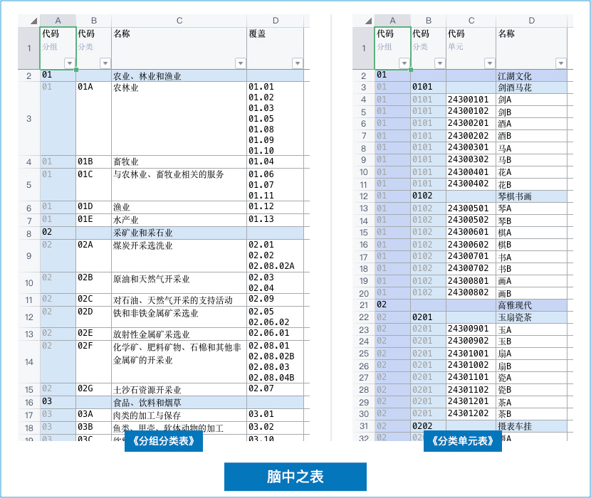
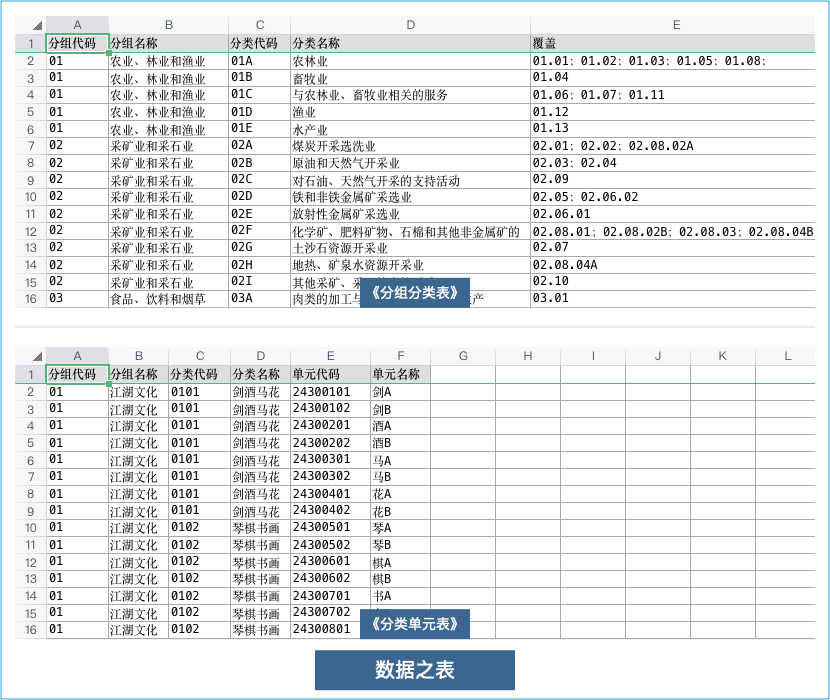
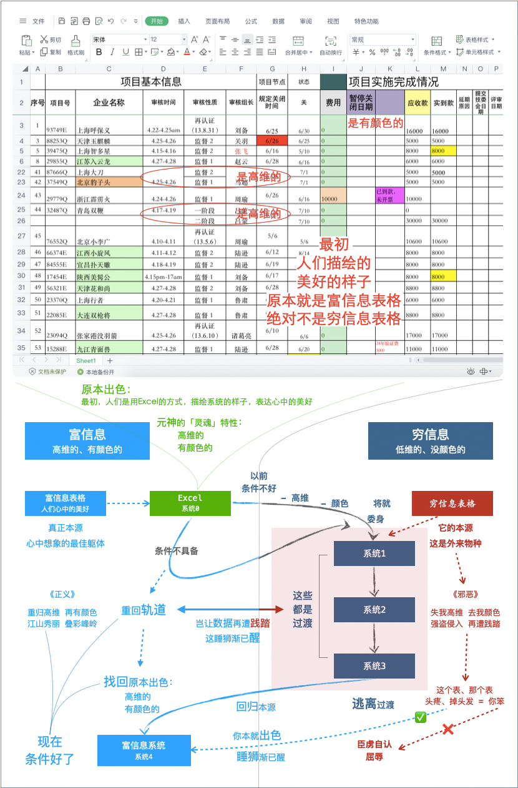

适配高网速、好电脑的，认证机构信息管理系统  
清爽、高级、惊艳、生态，新时代的驾驭感  
主理人：麦修行（大江东去，唯我修行）

[麦修行][]&nbsp;&nbsp;&nbsp;&nbsp;[AI->东方神功][东方神功]&nbsp;[剧情][]&nbsp;[人物][]&nbsp;&nbsp;&nbsp;&nbsp;[原理][]&nbsp;&nbsp;[规则][]&nbsp;&nbsp;[价格][]&nbsp;&nbsp;[购买][]&nbsp;&nbsp;&nbsp;&nbsp;[高奢团][]&nbsp;&nbsp;&nbsp;&nbsp;[发展历程][]

[麦修行]: https://github.com/ca3w/BEST
[东方神功]: https://github.com/ca3w/ai-dongfangshengong
[剧情]: https://github.com/ca3w/dongfangernvqing/blob/main/root/BEST.md
[人物]: https://github.com/ca3w/dongfangernvqing/blob/main/root/renwu.md
[原理]: https://github.com/ca3w/key
[规则]: https://github.com/ca3w/rule
[价格]: https://github.com/ca3w/pricing
[购买]: https://github.com/ca3w/howtobuy
[高奢团]: https://github.com/ca3w/tuan
[发展历程]: https://github.com/ca3w/development

***

# 原理

## 系统本贵，卿本高级

&nbsp;&nbsp;&nbsp;&nbsp;&nbsp;&nbsp;&nbsp;&nbsp;&nbsp;&nbsp;&nbsp;&nbsp;&nbsp;&nbsp;&nbsp;&nbsp;&nbsp;&nbsp;《系统本贵》&nbsp;&nbsp;&nbsp;&nbsp;&nbsp;&nbsp;&nbsp;&nbsp;&nbsp;&nbsp;&nbsp;&nbsp;&nbsp;&nbsp;&nbsp;&nbsp;&nbsp;&nbsp;&nbsp;&nbsp;&nbsp;&nbsp;&nbsp;&nbsp;&nbsp;&nbsp;&nbsp;&nbsp;&nbsp;&nbsp;&nbsp;&nbsp;&nbsp;&nbsp;&nbsp;《等你觉醒》  
&nbsp;&nbsp;&nbsp;&nbsp;&nbsp;&nbsp;&nbsp;&nbsp;盛世舞饭菜，正器尚无彩。&nbsp;&nbsp;&nbsp;&nbsp;&nbsp;&nbsp;&nbsp;&nbsp;&nbsp;&nbsp;&nbsp;&nbsp;&nbsp;&nbsp;&nbsp;&nbsp;网速豪情，电脑神威。  
&nbsp;&nbsp;&nbsp;&nbsp;&nbsp;&nbsp;&nbsp;&nbsp;大钱花到位，档次才上来。&nbsp;&nbsp;&nbsp;&nbsp;&nbsp;&nbsp;&nbsp;&nbsp;&nbsp;&nbsp;&nbsp;&nbsp;&nbsp;&nbsp;&nbsp;&nbsp;系统当富，卿本高级。

> 盛世舞饭菜：时代变了，现在是盛世！吃饭吃菜之前，像帝王一样，有人跳舞助兴  
> 正器尚无彩：正器，正用的器、指的是系统，尚无彩，还没有颜色、暗指不够高级  
> 大钱花到位：你现在网速高不高，数据复杂度高不高，和时代适配，只能大钱到位  
> 档次才上来：高配时代低配系统，档次永远在低档次，小系统不行，吞不下大时代

> 系统当富：时代背景下，网速有豪情，电脑也有神威，系统应当使用富信息的系统

重点说说什么叫作「卿本高级」？

先谈两个基本概念「脑中表格」和「数据之表」  
&nbsp;&nbsp;&nbsp;&nbsp;&nbsp;&nbsp;&nbsp;&nbsp;下面，体系认证以《分组分类表》为例，产品认证以《分类单元表》为例，阐述下**需求与实现的偏差**  
&nbsp;&nbsp;&nbsp;&nbsp;&nbsp;&nbsp;&nbsp;&nbsp;「认证机构的技术人员」的**剑锋所指**和「开发系统的技术人员」的**引弓所向**，**射箭靶心**不一致的问题  

&nbsp;&nbsp;&nbsp;&nbsp;&nbsp;&nbsp;&nbsp;&nbsp;&nbsp;&nbsp;&nbsp;&nbsp;&nbsp;&nbsp;&nbsp;&nbsp;如果让认证机构的技术人员，用 Excel 把他**好理解**的表格表达出来  
&nbsp;&nbsp;&nbsp;&nbsp;&nbsp;&nbsp;&nbsp;&nbsp;&nbsp;&nbsp;&nbsp;&nbsp;&nbsp;&nbsp;&nbsp;&nbsp;就是说这个表要以后经常看，得和**脑子里想的**相对应，这样**好理解**  
&nbsp;&nbsp;&nbsp;&nbsp;&nbsp;&nbsp;&nbsp;&nbsp;&nbsp;&nbsp;&nbsp;&nbsp;&nbsp;&nbsp;&nbsp;&nbsp;那么我想，Ta接近于下面的样子（这种**好理解**的，就叫：脑中之表）：  

&nbsp;&nbsp;&nbsp;&nbsp;&nbsp;&nbsp;&nbsp;&nbsp;&nbsp;&nbsp;&nbsp;&nbsp;&nbsp;&nbsp;&nbsp;&nbsp;如果让开发系统的技术人员，用 Excel 把他**容易做**的表格表达出来  
&nbsp;&nbsp;&nbsp;&nbsp;&nbsp;&nbsp;&nbsp;&nbsp;&nbsp;&nbsp;&nbsp;&nbsp;&nbsp;&nbsp;&nbsp;&nbsp;就是说这个表要代码上实现，得和**数据库的表**相对应，这样**容易做**  
&nbsp;&nbsp;&nbsp;&nbsp;&nbsp;&nbsp;&nbsp;&nbsp;&nbsp;&nbsp;&nbsp;&nbsp;&nbsp;&nbsp;&nbsp;&nbsp;那么我想，Ta接近于下面的样子（这种**容易做**的，就叫：数据之表）：  

什么叫作「卿本高级」？  
&nbsp;&nbsp;&nbsp;&nbsp;&nbsp;&nbsp;&nbsp;&nbsp;认证机构上系统，陌上人如玉，公子世无双。人们都是向往美好的  
&nbsp;&nbsp;&nbsp;&nbsp;&nbsp;&nbsp;&nbsp;&nbsp;本来呢，剑锋所指->「脑中之表」，费尽心思的想、费尽唇舌的说  
&nbsp;&nbsp;&nbsp;&nbsp;&nbsp;&nbsp;&nbsp;&nbsp;实际呢，引弓射箭，折腾来、折腾去，做出来的全都是「数据之表」

&nbsp;&nbsp;&nbsp;&nbsp;&nbsp;&nbsp;&nbsp;&nbsp;为什么呢？  
&nbsp;&nbsp;&nbsp;&nbsp;&nbsp;&nbsp;&nbsp;&nbsp;想要1:1的实现「脑中之表」，是非常难的，甚至一度被认为不可能

&nbsp;&nbsp;&nbsp;&nbsp;&nbsp;&nbsp;&nbsp;&nbsp;万恶之源，正在于此！🤮  
&nbsp;&nbsp;&nbsp;&nbsp;&nbsp;&nbsp;&nbsp;&nbsp;头疼病根，正在于此！🥶

&nbsp;&nbsp;&nbsp;&nbsp;&nbsp;&nbsp;&nbsp;&nbsp;以**数据库的糟糕表逻辑**，框束了**原本立体、优雅、美好的人类逻辑**  
&nbsp;&nbsp;&nbsp;&nbsp;&nbsp;&nbsp;&nbsp;&nbsp;如此避繁就简，全面的用**数据表的逻辑**解决一切，属于**反人类设计**  
&nbsp;&nbsp;&nbsp;&nbsp;&nbsp;&nbsp;&nbsp;&nbsp;等于变相强制让人全都用**数据表的逻辑**去想事情，岂能不让人头疼  
&nbsp;&nbsp;&nbsp;&nbsp;&nbsp;&nbsp;&nbsp;&nbsp;很多地方，尤其是涉及对象较多的地方，**根本就不适合**用这种将就  
&nbsp;&nbsp;&nbsp;&nbsp;&nbsp;&nbsp;&nbsp;&nbsp;长此以往，甚至会**改变正常思维方式**：让人脑弃高维而走程序思维  
&nbsp;&nbsp;&nbsp;&nbsp;&nbsp;&nbsp;&nbsp;&nbsp;从「卿本高级」变成「卿本数据表」，立体、优雅、美好，全没了

&nbsp;&nbsp;&nbsp;&nbsp;&nbsp;&nbsp;&nbsp;&nbsp;这个表、那个表、表间关系，怎么可以如此大量的让「人脑」去想  
&nbsp;&nbsp;&nbsp;&nbsp;&nbsp;&nbsp;&nbsp;&nbsp;这个表、那个表、表间关系，应该让「CPU」去计算，呈现出美好  
&nbsp;&nbsp;&nbsp;&nbsp;&nbsp;&nbsp;&nbsp;&nbsp;这个「CPU呈现出的美好」其实就是「脑中之表」，所谓回归本源

诗句中的「卿本高级」？  
&nbsp;&nbsp;&nbsp;&nbsp;&nbsp;&nbsp;&nbsp;&nbsp;时代变了，条件好了，过去觉得不可能的事，现在已经可以实现了  
&nbsp;&nbsp;&nbsp;&nbsp;&nbsp;&nbsp;&nbsp;&nbsp;打破常规，实现「脑中之表」，找回「卿本高级」，做到回归本源  
&nbsp;&nbsp;&nbsp;&nbsp;&nbsp;&nbsp;&nbsp;&nbsp;回归本源，才能真正解决问题，才能**让人真正喜欢系统、优雅工作**

认证机构上系统，就好像：

&nbsp;&nbsp;&nbsp;&nbsp;&nbsp;&nbsp;&nbsp;&nbsp;你提需求：剑锋所指，我来实现：引弓射箭

&nbsp;&nbsp;&nbsp;&nbsp;&nbsp;&nbsp;&nbsp;&nbsp;我当然是知道、也会：建数据库、建表写码，一顿操作、就完成了  
&nbsp;&nbsp;&nbsp;&nbsp;&nbsp;&nbsp;&nbsp;&nbsp;这就好比射箭，射眼巴前这个靶、非常容易，但这已经不合时代了

&nbsp;&nbsp;&nbsp;&nbsp;&nbsp;&nbsp;&nbsp;&nbsp;我们得射千山万水之外的那个靶，唯有如此，我们才能无愧于时代

&nbsp;&nbsp;&nbsp;&nbsp;&nbsp;&nbsp;&nbsp;&nbsp;&nbsp;&nbsp;&nbsp;&nbsp;&nbsp;&nbsp;&nbsp;&nbsp;我亲爱的朋友：  
&nbsp;&nbsp;&nbsp;&nbsp;&nbsp;&nbsp;&nbsp;&nbsp;&nbsp;&nbsp;&nbsp;&nbsp;&nbsp;&nbsp;&nbsp;&nbsp;上系统也要有些使命感！

&nbsp;&nbsp;&nbsp;&nbsp;&nbsp;&nbsp;&nbsp;&nbsp;&nbsp;&nbsp;&nbsp;&nbsp;&nbsp;&nbsp;&nbsp;&nbsp;我们不能总是避重就轻、反反复复的射向眼巴前的、看得见的，初步信息化的近靶。  
&nbsp;&nbsp;&nbsp;&nbsp;&nbsp;&nbsp;&nbsp;&nbsp;&nbsp;&nbsp;&nbsp;&nbsp;&nbsp;&nbsp;&nbsp;&nbsp;我们必须是破除万难的、毅然决然的射向非常远的、看不见的，代表高品质的远靶！

&nbsp;&nbsp;&nbsp;&nbsp;&nbsp;&nbsp;&nbsp;&nbsp;&nbsp;&nbsp;&nbsp;&nbsp;&nbsp;&nbsp;&nbsp;&nbsp;唯有如此！  
&nbsp;&nbsp;&nbsp;&nbsp;&nbsp;&nbsp;&nbsp;&nbsp;&nbsp;&nbsp;&nbsp;&nbsp;&nbsp;&nbsp;&nbsp;&nbsp;宽带的网速才会说我们有档次，这配得上它的豪情！  
&nbsp;&nbsp;&nbsp;&nbsp;&nbsp;&nbsp;&nbsp;&nbsp;&nbsp;&nbsp;&nbsp;&nbsp;&nbsp;&nbsp;&nbsp;&nbsp;电脑的芯片才会说我们有格局，这对得起它的神威！  
&nbsp;&nbsp;&nbsp;&nbsp;&nbsp;&nbsp;&nbsp;&nbsp;&nbsp;&nbsp;&nbsp;&nbsp;&nbsp;&nbsp;&nbsp;&nbsp;才不负所有员工新时代的期望，真正提高工作品质，让人焕然一新，一切更加美好！

卿本高级：  
&nbsp;&nbsp;&nbsp;&nbsp;&nbsp;&nbsp;&nbsp;&nbsp;你本就有的：立体、优雅、美好的人类逻辑，你需要的是：**美好呈现、一种驾驭数据的美好感觉**  
&nbsp;&nbsp;&nbsp;&nbsp;&nbsp;&nbsp;&nbsp;&nbsp;而不是被**数据库、数据表的糟糕逻辑**所框束，如果一味只是数据管理，那就烧脑了，难免会头疼  
&nbsp;&nbsp;&nbsp;&nbsp;&nbsp;&nbsp;&nbsp;&nbsp;&nbsp;&nbsp;&nbsp;&nbsp;&nbsp;&nbsp;&nbsp;&nbsp;头疼原理：  
&nbsp;&nbsp;&nbsp;&nbsp;&nbsp;&nbsp;&nbsp;&nbsp;&nbsp;&nbsp;&nbsp;&nbsp;&nbsp;&nbsp;&nbsp;&nbsp;系统本质上是大量原始数据CRUD， 堆积而成！实际已沦为**原始数据堆积场**  
&nbsp;&nbsp;&nbsp;&nbsp;&nbsp;&nbsp;&nbsp;&nbsp;&nbsp;&nbsp;&nbsp;&nbsp;&nbsp;&nbsp;&nbsp;&nbsp;只是上下表关系能想明白就不错了，脑力高维，是让人沦为**转化高维的奴隶**  
&nbsp;&nbsp;&nbsp;&nbsp;&nbsp;&nbsp;&nbsp;&nbsp;&nbsp;&nbsp;&nbsp;&nbsp;&nbsp;&nbsp;&nbsp;&nbsp;那你自然就会觉得：工作很累！  
&nbsp;&nbsp;&nbsp;&nbsp;&nbsp;&nbsp;&nbsp;&nbsp;&nbsp;&nbsp;&nbsp;&nbsp;&nbsp;&nbsp;&nbsp;&nbsp;&nbsp;&nbsp;&nbsp;&nbsp;&nbsp;&nbsp;&nbsp;&nbsp;或许，所有的数据都在里面  
&nbsp;&nbsp;&nbsp;&nbsp;&nbsp;&nbsp;&nbsp;&nbsp;&nbsp;&nbsp;&nbsp;&nbsp;&nbsp;&nbsp;&nbsp;&nbsp;&nbsp;&nbsp;&nbsp;&nbsp;&nbsp;&nbsp;&nbsp;&nbsp;但是：任何地方都无法看清  
&nbsp;&nbsp;&nbsp;&nbsp;&nbsp;&nbsp;&nbsp;&nbsp;&nbsp;&nbsp;&nbsp;&nbsp;&nbsp;&nbsp;&nbsp;&nbsp;&nbsp;&nbsp;&nbsp;&nbsp;&nbsp;&nbsp;&nbsp;&nbsp;罪在系统：正所谓不知者无罪、所以不见者也无罪，无罪  
&nbsp;&nbsp;&nbsp;&nbsp;&nbsp;&nbsp;&nbsp;&nbsp;&nbsp;&nbsp;&nbsp;&nbsp;&nbsp;&nbsp;&nbsp;&nbsp;&nbsp;&nbsp;&nbsp;&nbsp;&nbsp;&nbsp;&nbsp;&nbsp;摸鱼无罪：反正像无底洞一样，完成自己的这一块，完事  
&nbsp;&nbsp;&nbsp;&nbsp;&nbsp;&nbsp;&nbsp;&nbsp;脑中之表应该被**现代的、富信息对等逻辑**完美匹配、完美呈现，让人一眼看明白，让人更舒适  
&nbsp;&nbsp;&nbsp;&nbsp;&nbsp;&nbsp;&nbsp;&nbsp;&nbsp;&nbsp;&nbsp;&nbsp;&nbsp;&nbsp;&nbsp;&nbsp;舒适原理：  
&nbsp;&nbsp;&nbsp;&nbsp;&nbsp;&nbsp;&nbsp;&nbsp;&nbsp;&nbsp;&nbsp;&nbsp;&nbsp;&nbsp;&nbsp;&nbsp;系统本质上是用CPU处理原始数据，加工成富信息，然后利用高网速传给你  
&nbsp;&nbsp;&nbsp;&nbsp;&nbsp;&nbsp;&nbsp;&nbsp;&nbsp;&nbsp;&nbsp;&nbsp;&nbsp;&nbsp;&nbsp;&nbsp;你会觉得：这就是我想要的，而且你也清楚：数据太多，我自己弄不了这样  
&nbsp;&nbsp;&nbsp;&nbsp;&nbsp;&nbsp;&nbsp;&nbsp;&nbsp;&nbsp;&nbsp;&nbsp;&nbsp;&nbsp;&nbsp;&nbsp;那你自然就会觉得：系统真好！  
&nbsp;&nbsp;&nbsp;&nbsp;&nbsp;&nbsp;&nbsp;&nbsp;&nbsp;&nbsp;&nbsp;&nbsp;&nbsp;&nbsp;&nbsp;&nbsp;&nbsp;&nbsp;&nbsp;&nbsp;&nbsp;&nbsp;&nbsp;&nbsp;系统懂你：给你的是「脑中之表」，一看就懂，就要这种  
&nbsp;&nbsp;&nbsp;&nbsp;&nbsp;&nbsp;&nbsp;&nbsp;&nbsp;&nbsp;&nbsp;&nbsp;&nbsp;&nbsp;&nbsp;&nbsp;&nbsp;&nbsp;&nbsp;&nbsp;&nbsp;&nbsp;&nbsp;&nbsp;系统助你：给你的是「实时数据」，大量高维，可观全局  
&nbsp;&nbsp;&nbsp;&nbsp;&nbsp;&nbsp;&nbsp;&nbsp;&nbsp;&nbsp;&nbsp;&nbsp;&nbsp;&nbsp;&nbsp;&nbsp;&nbsp;&nbsp;&nbsp;&nbsp;&nbsp;&nbsp;&nbsp;&nbsp;或许，有时候很难想明白的  
&nbsp;&nbsp;&nbsp;&nbsp;&nbsp;&nbsp;&nbsp;&nbsp;&nbsp;&nbsp;&nbsp;&nbsp;&nbsp;&nbsp;&nbsp;&nbsp;&nbsp;&nbsp;&nbsp;&nbsp;&nbsp;&nbsp;&nbsp;&nbsp;但是：打开系统一眼看明白  
&nbsp;&nbsp;&nbsp;&nbsp;&nbsp;&nbsp;&nbsp;&nbsp;&nbsp;&nbsp;&nbsp;&nbsp;&nbsp;&nbsp;&nbsp;&nbsp;&nbsp;&nbsp;&nbsp;&nbsp;&nbsp;&nbsp;&nbsp;&nbsp;摸鱼有罪：如果是万美一瑕、视而不见，我想会有负罪感

认证机构 剑锋所指  |开发系统 引弓所向  | 使用本质  | 压力在哪  | 效果  | 解释               | 症状
-----------------------|-----------------------|:--------------|:--------------|:----------|:-----------------------|:-----------
脑中之表🎯            |脑中之表🎯             |卿本高级       |CPU            |补脑       |靠系统补充脑袋想不到的  |舒适、长寿
脑中之表🎯            |数据之表💘             |卿本数据表     |你的脑袋       |脑补       |靠脑袋补充系统做不到的  |头疼🥶

## 原本出色，回归本源

曾经的你，用Excel都知道应该弄成高维的，用Excel都知道应该弄成有颜色的，那上系统之后呢？

数据宛若「元神」，系统就像「躯体」，「数据」放入「系统」，就好比：「元神」放入「躯体」  
认证机构的上系统：就是为所有人辛辛苦苦形成的「数据元神」，找一个：诠释其灵魂的「躯体」

最初，人们是用Excel的方式，描绘系统的样子， 表达心中的美好。 按人们「心中的美好」去诠释  
虽然当时人们并不知道「心中的美好」其实叫作「富信息表格」，但却找到了元神的「灵魂」特性

&nbsp;&nbsp;&nbsp;&nbsp;&nbsp;&nbsp;&nbsp;&nbsp;认证机构的「数据元神」「灵魂」特性是：  
&nbsp;&nbsp;&nbsp;&nbsp;&nbsp;&nbsp;&nbsp;&nbsp;&nbsp;&nbsp;&nbsp;&nbsp;&nbsp;&nbsp;&nbsp;&nbsp;高维的  
&nbsp;&nbsp;&nbsp;&nbsp;&nbsp;&nbsp;&nbsp;&nbsp;&nbsp;&nbsp;&nbsp;&nbsp;&nbsp;&nbsp;&nbsp;&nbsp;有颜色的

但是，由于以前条件不好，网速不高，技术有限，信息化建设不得不将就、委身于「穷信息表格」  
为了好实现「失高维」、「去颜色」，从而导致「数据元神」没「灵魂」成了「行尸走肉的感觉」

与其说「穷信息」让「数据元神」没「灵魂」，不如说「穷信息」根本就不适合装载「数据元神」  
认证机构的「数据元神」，由于其本身的「灵魂」特性，决定了其装载「躯体」只能是「富信息」

现在，条件好了！网速够高了！用AI开发了！应该用「富信息」装载「数据元神」让其有「灵魂」  
曾经用Excel就能表达的美好， 得到现代技术加持，应该更加美好， 而不是丢掉最美丽的「灵魂」

我的做法（云）、我的价格（贵）、我的设计（武侠）、我的执着（AI）等等，你可能很难理解  
但我必须告诉你：我是在为「元神归位」而战，是为「诠释灵魂」而战，是为「美好未来」而战

你给我二三十万，我弄四五十张表，当然能点通顺了，当然能本地部署，但我真的不屑于那样做  
那是初步信息化，那是不合时代的，那是没有灵魂的，那会是行尸走肉，那对使用者是一种邪恶

其实不是钱的事，也不是云不云的，更不是上系统一定要找我。对于系统这件事，你应该做的是

&nbsp;&nbsp;&nbsp;&nbsp;&nbsp;&nbsp;&nbsp;&nbsp;把「数据元神」的「本命躯体」找到，放进去以「诠释灵魂」，绽放美好  
&nbsp;&nbsp;&nbsp;&nbsp;&nbsp;&nbsp;&nbsp;&nbsp;所有人辛辛苦苦形成的「数据元神」，能够「美好呈现」，这才是正义的

&nbsp;&nbsp;&nbsp;&nbsp;&nbsp;&nbsp;&nbsp;&nbsp;邪恶的是：穷信息的CURD，它配不上你的网速、你的电脑，它早该淘汰了  
&nbsp;&nbsp;&nbsp;&nbsp;&nbsp;&nbsp;&nbsp;&nbsp;系统是行尸走肉的，是没有灵魂的，「数据元神」放进去不能「美好呈现」  
&nbsp;&nbsp;&nbsp;&nbsp;&nbsp;&nbsp;&nbsp;&nbsp;那都是原始数据的，是浑浑噩噩的，「使用者」是「数据表」的「工具人」  
&nbsp;&nbsp;&nbsp;&nbsp;&nbsp;&nbsp;&nbsp;&nbsp;系统是简单表堆积，不是系统为你「呈现美好」，是你为系统「献祭脑力」  
&nbsp;&nbsp;&nbsp;&nbsp;&nbsp;&nbsp;&nbsp;&nbsp;那是你用200kb/s，老电脑就能用的一堆列表，穷信息、其实早已不合时代

幸福就是：那么多人辛辛苦苦付出的努力，所形成的数据，能够以诠释灵魂非常美好的方式呈现  
我以我的方式，我的能力，帮助有需要的认证机构，简单的、快速的，就能找到、实现这种幸福

这么大的机构，那么多人的努力，这么好的时代，以后多年的积累，都为穷信息的CURD而殉葬？  
这么做真值吗？我觉得太不值了！我相信做富信息的好云端，找回原本的美好，这是有意义的事

时代巨变，在大宽带、高网速的趋势下，还走穷信息的道路，那一定是错误的，再付出也没意义  
使命在身，我们必须向正确的方向前进，要走富信息的道路，尽管道路很难走，但未来属于我们

&nbsp;&nbsp;&nbsp;&nbsp;&nbsp;&nbsp;&nbsp;&nbsp;**「得高维」，「上颜色」，此「先表」所以兴隆也；**  
&nbsp;&nbsp;&nbsp;&nbsp;&nbsp;&nbsp;&nbsp;&nbsp;**「失高维」，「去颜色」，此「后表」所以倾颓也。**  
&nbsp;&nbsp;&nbsp;&nbsp;&nbsp;&nbsp;&nbsp;&nbsp;**先帝在时，每与臣论此事，未尝不叹息痛恨于「系统」也。**  
&nbsp;&nbsp;&nbsp;&nbsp;&nbsp;&nbsp;&nbsp;&nbsp;**「九剑、飞针、莫言、神驭、归宗」，此悉贞良死节之臣，**  
&nbsp;&nbsp;&nbsp;&nbsp;&nbsp;&nbsp;&nbsp;&nbsp;**愿陛下亲之信之，则「系统」之隆，可计日而待也。**

&nbsp;&nbsp;&nbsp;&nbsp;&nbsp;&nbsp;&nbsp;&nbsp;**今「网速已高」，「电脑已好」，**  
&nbsp;&nbsp;&nbsp;&nbsp;&nbsp;&nbsp;&nbsp;&nbsp;**当奖率三军，北定中原，庶竭驽钝，攘除奸凶，**  
&nbsp;&nbsp;&nbsp;&nbsp;&nbsp;&nbsp;&nbsp;&nbsp;**兴复「系统」，「还归清爽」。此臣所以报先帝而忠陛下之职分也。**

## 表面品质，背后体量

系统表面上看品质很高，实际是背后的代码体量

一般的系统代码体量：50M-200M  
我做的系统代码体量：800M-2G/大模型（主剑）

> 不仅体量大了， 而且AI写的代码品质还更高

确实是大部分AI来实现，但不代表能更快的实现  
而是这个活如果没有AI，太复杂、根本就干不了  
实际上可能会更耗时间，但是最后的品质是高的

## 隐喻投射，扯蛋有理

为什么搞武功、兵法、阵法？  

这就叫认知层面的「隐喻投射」，我将「抽象的高级」，具象化「你熟悉的认知框架」，降低了「你的学习门槛」  
你在学习时产生的「补偿联想」，抵掉「学复杂东西时，大脑自发抵抗所产生的痛苦」，这样你能无痛学会高级

所以：扯蛋有理，这是艺术！

看似很荒唐呀！但这确实是在正正经经、认认真真的为认证机构设计、研发、制作认证机构专用的信息管理系统

#### 《道德经》：“无心生大用，有物不通神”

无心：你想不到，从小到大看的武侠，形成的那种“武学理解”，居然在工作中能用上，而且非常的好用、好理解  
有物：具体化的，就不行！不通神了，如果你去执着富信息技术在每一块的具体应用，那会特别不好学、累吐血

所以：你老老实实学东方神功就好了，以「玩」的心态、对武侠的「热爱」激活本会，再找作者上系统、就神了  
否则：弄个“有物”，用不了多久、扔！如果是“无物”的系统，通了你的“神”，怎么扔？你根本就没法扔、无物的

只有这种「无物」、「通神」的系统，才是你的归宿，像这种「激活你的本会高级」，才能用很久、甚至一辈子

## 敢为人先，提振士气

认证机构最容易忽略的其实是：系统对工作品质、工作心态的影响，隐性心理影响、隐性人文影响被严重的低估  
其实员工或许比高层更懂高级、更懂高维、更懂灵动，什么是好的，他们分得出来，只不过碍于情面他们很难说  
这个就相当于古代战争的士气，对于大的机构，尤其有实力的机构，值得与时俱进，值得使用符合时代的好系统

## 梁山缺豪，我来弥补

麦修行创业、做这个事情，这个意、这个象，好比是什么呢？

早年，麦修行接触过梁山，发现梁山这帮人，穿的衣服不行：  
&nbsp;&nbsp;&nbsp;&nbsp;&nbsp;&nbsp;&nbsp;&nbsp;行业太偏、没人知道；行业太窄、没多少人。  
&nbsp;&nbsp;&nbsp;&nbsp;&nbsp;&nbsp;&nbsp;&nbsp;穿的衣服，不堪入目：这个设计、这个做工，都不行。  
&nbsp;&nbsp;&nbsp;&nbsp;&nbsp;&nbsp;&nbsp;&nbsp;简直是像小孩子做的：瓦匠剪裁，铁匠走线，穿起来十分不得体。

整个梁山，虽然鱼龙混杂，但不乏有一些豪杰之士！我想豪杰当有豪情：  
&nbsp;&nbsp;&nbsp;&nbsp;&nbsp;&nbsp;&nbsp;&nbsp;不只是：“大碗喝酒、大口吃肉、大秤分金银”  
&nbsp;&nbsp;&nbsp;&nbsp;&nbsp;&nbsp;&nbsp;&nbsp;更应该：“大碗喝酒、大口吃肉、大秤分金银、穿豪气的好衣服”  
&nbsp;&nbsp;&nbsp;&nbsp;&nbsp;&nbsp;&nbsp;&nbsp;梁山有酒有肉有金银、缺豪气的好衣服，我想我来弥补这个位置。

所以：麦修行才做的这个营生，才下了血成制作好衣服，初心就是为了卖给豪杰之士：  
&nbsp;&nbsp;&nbsp;&nbsp;&nbsp;&nbsp;&nbsp;&nbsp;真的做不到：让梁山上人人穿豪气的好衣服。  
&nbsp;&nbsp;&nbsp;&nbsp;&nbsp;&nbsp;&nbsp;&nbsp;能且只能是：让梁山上有眼光的、有豪情的豪杰之士，穿貂带金。

麦修行是做到这种程度，才悟出的人间限制：  
&nbsp;&nbsp;&nbsp;&nbsp;&nbsp;&nbsp;&nbsp;&nbsp;任何一个行当：  
&nbsp;&nbsp;&nbsp;&nbsp;&nbsp;&nbsp;&nbsp;&nbsp;要是真做到极致、真的超凡脱俗、真的出众，  
&nbsp;&nbsp;&nbsp;&nbsp;&nbsp;&nbsp;&nbsp;&nbsp;除非是你做的物件本身就是个俗物，否则：**贵气只能属于少数人**。

成本高、不高价就赔了、不得不只做高端......这些只是表面，从玄学上，或许有一条人间限制：**贵气只能属于少数人**。  
&nbsp;&nbsp;&nbsp;&nbsp;&nbsp;&nbsp;&nbsp;&nbsp;麦修行纵有善心，可是他无法突破人间限制。  
&nbsp;&nbsp;&nbsp;&nbsp;&nbsp;&nbsp;&nbsp;&nbsp;安得广厦千万间，大庇天下寒士俱欢颜，诗好写，逆天之事难为！  
&nbsp;&nbsp;&nbsp;&nbsp;&nbsp;&nbsp;&nbsp;&nbsp;这世间，吃穿出用行，都有这个限制：真是实打实做好的，拿出来一卖，就便宜不了：  
&nbsp;&nbsp;&nbsp;&nbsp;&nbsp;&nbsp;&nbsp;&nbsp;&nbsp;&nbsp;&nbsp;&nbsp;&nbsp;&nbsp;&nbsp;&nbsp;如果真是不喂饲料，吃橡果的，数年腌制，这种火腿，不可能¥100一根  
&nbsp;&nbsp;&nbsp;&nbsp;&nbsp;&nbsp;&nbsp;&nbsp;&nbsp;&nbsp;&nbsp;&nbsp;&nbsp;&nbsp;&nbsp;&nbsp;如果真是黄金地段，独门独院，稀缺品质，这种别墅，不可能¥3000一平  
&nbsp;&nbsp;&nbsp;&nbsp;&nbsp;&nbsp;&nbsp;&nbsp;&nbsp;&nbsp;&nbsp;&nbsp;&nbsp;&nbsp;&nbsp;&nbsp;如果真是十年底蕴，符合时代，适配未来，这种系统，也不可能是一般价格

**天条就是：贵气只能属于少数人**：  
&nbsp;&nbsp;&nbsp;&nbsp;&nbsp;&nbsp;&nbsp;&nbsp;不可刻意卖贵，奸商的那种，而是不贵卖就赔了，好货平价你也供应不上  
&nbsp;&nbsp;&nbsp;&nbsp;&nbsp;&nbsp;&nbsp;&nbsp;如果某个商家，真能让梁山上所有的人都能「穿貂带金」，就是违背天条  
&nbsp;&nbsp;&nbsp;&nbsp;&nbsp;&nbsp;&nbsp;&nbsp;肯定假貂假金，自古以来不变的硬道理「一分钱一分货」，假的就真不了

所以：  
过去梁山脚下，是个卖衣服的，我都买得起，我都能看看，  
突然冷不丁的，来个卖天价的，你买不起了，这是正常的！因为天条如此：超凡脱俗、贵气无比，只能属于少数人！

## 阈值原理，有进无退

一条狗，粗茶淡饭的一直喂，是没有问题的。  
&nbsp;&nbsp;&nbsp;&nbsp;&nbsp;&nbsp;&nbsp;&nbsp;但是！  
&nbsp;&nbsp;&nbsp;&nbsp;&nbsp;&nbsp;&nbsp;&nbsp;你要是喂了半年火腿肠，再喂粗茶淡饭？  
&nbsp;&nbsp;&nbsp;&nbsp;&nbsp;&nbsp;&nbsp;&nbsp;狗就会有想法：这玩意，不是给狗吃的。

这个道理，人也是一样的：  
&nbsp;&nbsp;&nbsp;&nbsp;&nbsp;&nbsp;&nbsp;&nbsp;在研发[AI->东方神功][东方神功]的过程中，经历了无数次各种各样的折腾。  
&nbsp;&nbsp;&nbsp;&nbsp;&nbsp;&nbsp;&nbsp;&nbsp;以前：  
&nbsp;&nbsp;&nbsp;&nbsp;&nbsp;&nbsp;&nbsp;&nbsp;作者、麦修行是真的可以看那种没有高维、没有颜色的表格的，  
&nbsp;&nbsp;&nbsp;&nbsp;&nbsp;&nbsp;&nbsp;&nbsp;但是！  
&nbsp;&nbsp;&nbsp;&nbsp;&nbsp;&nbsp;&nbsp;&nbsp;自从九剑、飞针研发成功之后，高维、有颜色的表格看习惯了，  
&nbsp;&nbsp;&nbsp;&nbsp;&nbsp;&nbsp;&nbsp;&nbsp;就真的再也看不了那种表格了，觉得：那玩意，不是给人看的。

悟到：  
&nbsp;&nbsp;&nbsp;&nbsp;&nbsp;&nbsp;&nbsp;&nbsp;这其实是文明进化，大吞吐、富信息真的会拉升你的舒适阈值。  
&nbsp;&nbsp;&nbsp;&nbsp;&nbsp;&nbsp;&nbsp;&nbsp;其实，文明就是这世间很多东西都在一点点拉升你的舒适阈值。  
&nbsp;&nbsp;&nbsp;&nbsp;&nbsp;&nbsp;&nbsp;&nbsp;如果是跨时代的产品，拉升的就会非常的明显，冷不丁的飞仙，  
&nbsp;&nbsp;&nbsp;&nbsp;&nbsp;&nbsp;&nbsp;&nbsp;再想让你回去受罪去，那你可能是无法接受的，除非从未体验。

效果：  
&nbsp;&nbsp;&nbsp;&nbsp;&nbsp;&nbsp;&nbsp;&nbsp;当你习惯了所有表格都是高维的、都是有颜色的，都是清爽的，  
&nbsp;&nbsp;&nbsp;&nbsp;&nbsp;&nbsp;&nbsp;&nbsp;就很难退回再用那种一行一行的、低维没颜色的，是条不归路。

所以：  
&nbsp;&nbsp;&nbsp;&nbsp;&nbsp;&nbsp;&nbsp;&nbsp;大吞吐、富信息是进步、是文明，这种更新换代是有进无退的！

好比：  
&nbsp;&nbsp;&nbsp;&nbsp;&nbsp;&nbsp;&nbsp;&nbsp;你看惯了4K、60寸遥控的大彩电，再让你看按钮黑白的老电视。

## 三个如果，灵魂拷问

如果不是高维、有颜色的，那只是数据管理，不要体验了吗？  
如果不是灵动、大吞吐的，那这么高的网速，不就浪费了吗？  
如果不是云的、一体生态，那如何更新迭代，不再发展了吗？

## 有规有矩，有情有义

比如：卖80万，讲了情义，50万多点卖给你了，你觉得他没坑你。 转过身同样的东西， 他20万就卖给了别人。  
所以：不议价，按规矩来，定多少钱就多少钱，才是真的有情有义，喜欢讲价的，就去找别人，我做的是平台。

所有价格都是明码实价的，而且还是非常香的。如果你觉得很贵不香，那么希望你仔细的看清楚：档次、量级！  
达到同等档次、同等量级，你如果没有AI、不是云的、就构不成合用，没有资源整合，你自己弄，说不定更贵！

## 大江东去，唯我修行

这是一个多么浮躁的世界，人们有着多么糟糕的认知。

系统本来是「设计」占第一位的，而且应该是「专属设计」。  
而他们的「设计」只不过是用现成的框架，把数据库的简单语句操作，套上了「买的人」会操作的皮囊，而已。

好像是「功能」都实现了，而「专属设计」几乎是零，缺少最该有的「灵魂」。  
更糟糕的是：明明是买了个「版本冻结」的软件产品，却无视加密、还自以为掌握了软件的源代码，以此安慰！

没有「专属设计」、没有「灵魂」，当然是用不久的，「版本冻结」就意味着几年之后就淘汰了。  
买了扔，扔了再买，买了再扔，还得买，多么的糟糕，上系统都会有罪恶感，终究是沦为了罪恶感满满的羔羊！

这其中，有多少大佬想花钱、愿意花钱、甚至花大钱，想买一个真正的好系统，一直用下去，却有钱也买不到！

大佬的困惑，迷途的羔羊！  
我要做这个行业的英雄！我要做大佬的救星、福分！我要做真正的好系统！  
虽然难，但我不会放弃，我要颠覆这糟糕的认知、我要打破这浮躁的世界！我坚信我一定可以把系统做的更好！

认同我的朋友，让我们一起，缔造一个「专属设计」的、有「灵魂」的，生态发展的、赢得未来的美丽新世界！
